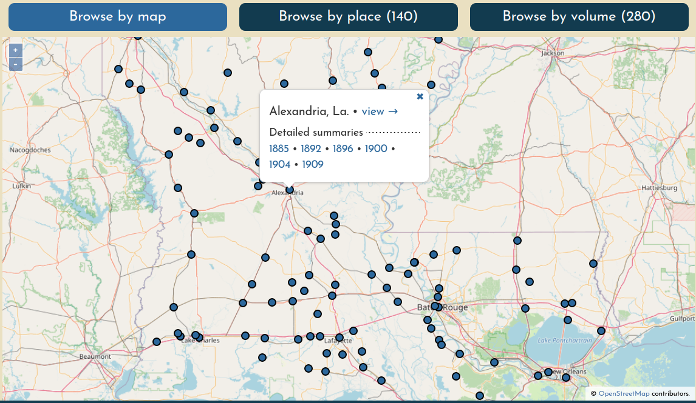

# Browsing the Content

You can search for map content in three different ways, all of which are accessible in the main [Browse](https://oldinsurancemaps.net/browse) page.

1. [Browse by Map](#browse-by-map)
2. [Browse by Place](#browse-by-place)
3. [Browse by Volume](#browse-by-volume)

Generally, each method can be used to find any map in the system, but there are a few subtleties to be aware of.

## Browse by Map

Click a point on the map to view its georeferenced Sanborn Maps. Click **view &rarr;** to open the [viewer](./viewer.md) for all volumes at once, or choose a volume/edition to go to its detailed summary.

Points on the map represent "places" (generally, cities, towns, or villages) with at least one volume that has at least one georeferenced document (the point is the centroid of all layer extents). This means that if volumes have been loaded for a place but none of their sheets have been georeferenced, there will be no way to find that content through this search method.

## Browse by Place

Find a place by name. Click the place name to open it in the main viewer, or choose a year to go directly to that volume summary.

## Browse by Volume

Search volumes by name, and click the title to go to the volume summary. You can sort the table by any column.

On the right, you'll see abbreviated columns holding more detailed information about the volume:

| | |
|-------------------------|-----------|
| **U** | Number of unprepared sheets |
| **P** | Number of prepared prepared documents (i.e. ready to be georeferenced) |
| **G** | Number of georeferenced documents |
| **%** | Overall percentage of georeferenced documents from the volume |
| **MM** | Number of georeferenced layers that are included in the volume's "multimask". Typically the denominator will be one less than the number of georeferenced layers because the multimask will not include the volume's Key Map. |

Power users can sort on these columns to see where their work can be the most effective.