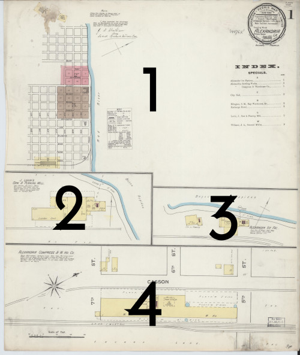
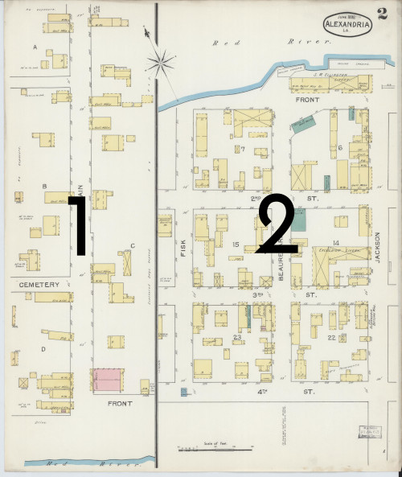
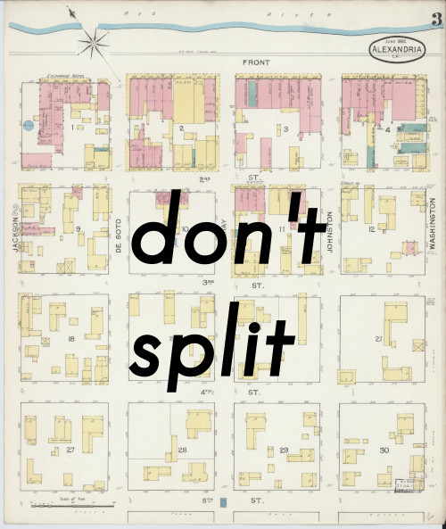

# Splitting documents

Before a document can be georeferenced, it must be visually evaluated to determine whether it contains more than one distinct region within it. For example, an inset on the page may show a different part of town, or a page may simply have two (or more) completely separate maps. In these cases, each of these parts must be split into separate documents so each one can be georeferenced individually.

## Background

Sometimes an old map document will cover discontiguous areas, especially when the mapmakers were trying to
fit a lot of content into a single page. In these cases, each separate area in the original document must be split into
its own new document, so that each area can be georeferenced on its own. Typically, you'll find
**strong black lines** delineating different parts of the map. The document must be split along those lines.

	<figure markdown="span" style="width:33%; padding:5px;">
		
		<figcaption>This map must be split into four new documents.</figcaption>
	</figure>
	<figure markdown="span" style="width:33%; padding:5px;">
		
		<figcaption>This map must be split into two new documents.</figcaption>
	</figure>
	<figure markdown="span" style="width:33%; padding:5px;">
		
		<figcaption>This map shows only one part of town, so it should not be split.</figcaption>
	</figure>

## Using the Interface

Here's a quick example of using the splitting interface to cut a sheet into three separate documents. *It is kind of a sloppy example, please be a bit more exact that this if you can!*

### Splitting the document

- Use the interface to create as many cut-lines as are needed to fully split this document.
- Once you have one or more valid cut-lines, a preview will appear showing how the image will be split.
- Click the scissors icon when you are ready.
- You will be redirected to the map overview page, while the split process runs in the background.
- If you split the document incorrectly, you can undo the process from the map summary page.

### Creating cut-lines

- In **Draw** mode, click once to start or continue a line, and double-click to finish it.
- Press **Esc** to cancel an in-progress drawing.
- Switch to **Modify** mode to change a cut-line.
- Click the "refresh" button to erase all lines and start over.

Understanding cut-lines:

- Once you have a valid cut-line, a preview will appear showing you how the document will be split.
- Only cut-lines that fully cross a segment of the document will be used&mdash;all others will safely be ignored.
- Cut-lines can intersect or extend from each other to handle complex shapes.
