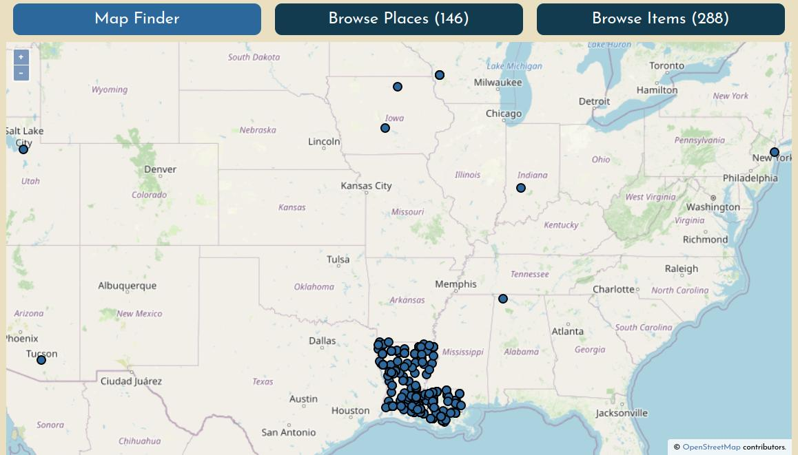
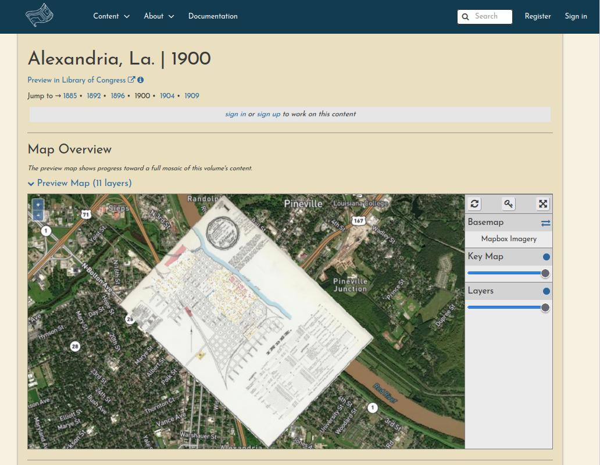
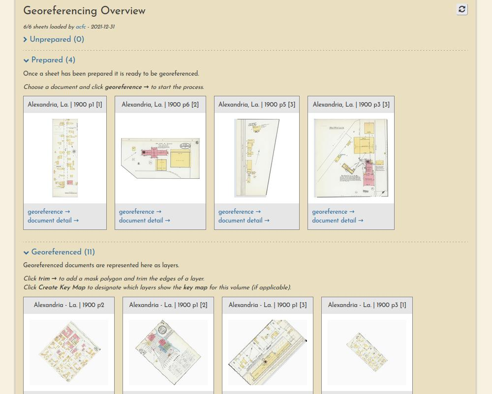
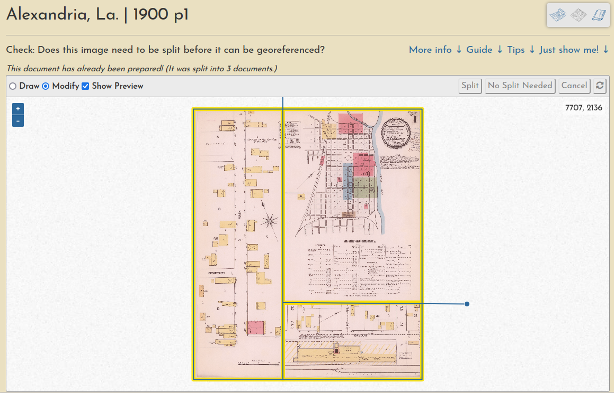
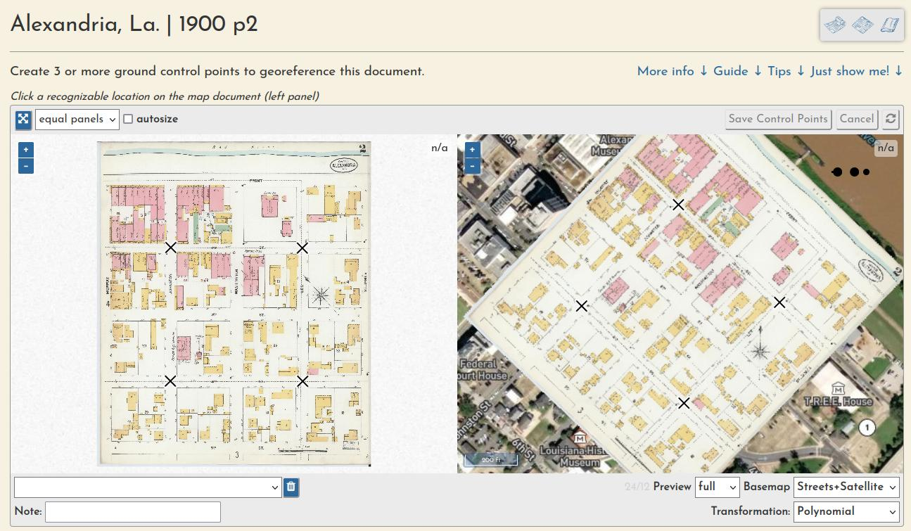
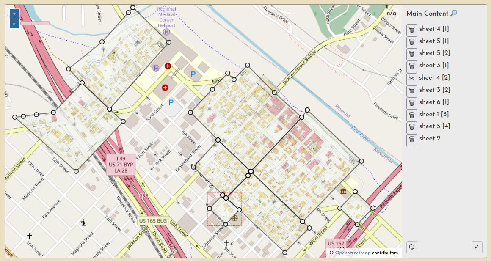

# Welcome!

_OldInsuranceMaps.net_ is a public space for creating and viewing georeferenced mosaics of historical fire insurance maps from the Library of Congress Sanborn Maps collection.

!!! tip "Important links"

    - [OldInsuranceMaps.net](https://oldinsurancemaps.net) - The main platform and georeferencing application.
    - [Online Historical Map Georeferencer (OHMG)](https://ohmg.dev) - Information about the concepts and open source software behind this project, including architecture and installation docs.
    - [OpenHistoricalMap Forum &rarr; OldInsuranceMaps.net](https://forum.openhistoricalmap.org/c/oldinsurancemaps/13) - Drop by to introduce yourself, and feel free to ask questions about the project and how people are using it.

## Site Overview

You can browse content in the platform by map, by place name, or by map name. To learn more about these search methods, see [Browsing the Content](./guides/browsing.md)

Each volume's summary page has an interactive Map Overview showing all of the sheets that have been georeferenced so far.

Each volume's summary page also lists the progress and georeferencing stage of each sheet.

Finally, each resource itself has its own page, showing a complete lineage of the work that has been performed on it by various users.

![Alexandria, La, 1900, p1 [2]](_assets/images/example-resource-alex-1900.jpg)

## Workflow Overview

The georeferencing process generally consists of three operations, each with their own browser interface.

### Preparation

Document preparation (sometimes they must be split into multiple pieces):

Learn more in [this guide](./guides/preparation.md).

### Georeferencing

Ground control point creation (these are used to warp the document into a geotiff):

Learn more in [this guide](./guides/georeferencing.md).

### Trimming

And a "multimask" that allows a volume's sheets to be trimmed *en masse*, a quick way to create a seamless mosaic from overlapping sheets:

Learn more in [this guide](./guides/trimming.md).

## Work Sessions

All user input is tracked through registered accounts, which allows for a comprehensive understanding of user engagement and participation, as well as a complete database of all input georeferencing information, like ground control points, masks, etc.