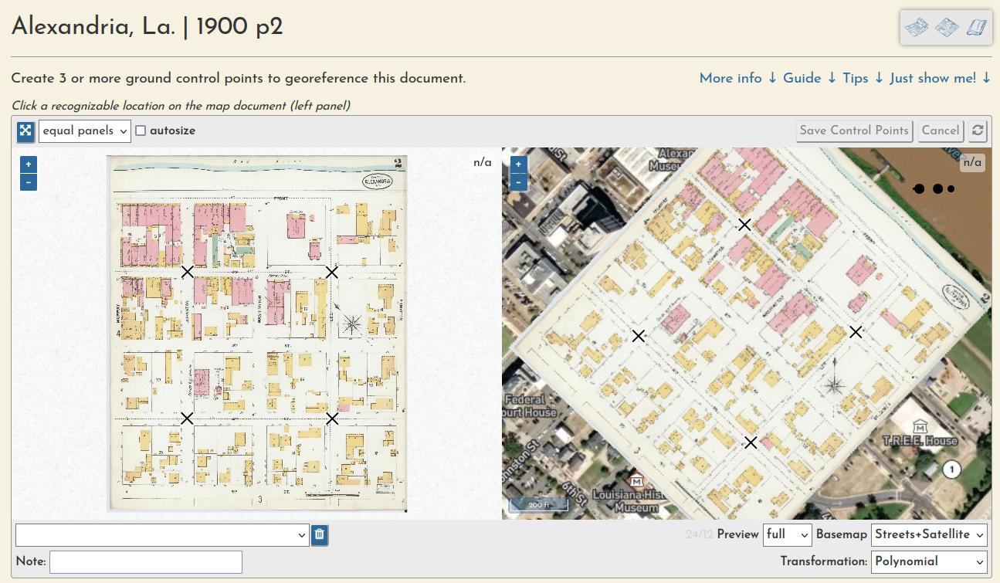

# Overview

The georeferencing process generally consists of three operations, each with their own browser interface.

Document preparation (sometimes they must be split into multiple pieces):

Ground control point creation (these are used to warp the document into a geotiff):

And a "multimask" that allows a volume's sheets to be trimmed *en masse*, a quick way to create a seamless mosaic from overlapping sheets:

Learn much more about each step [in the docs](https://ohmg.dev/docs/category/making-the-mosaics-1).

All user input is tracked through registered accounts, which allows for a comprehensive understanding of user engagement and participation, as well as a complete database of all input georeferencing information, like ground control points, masks, etc.
