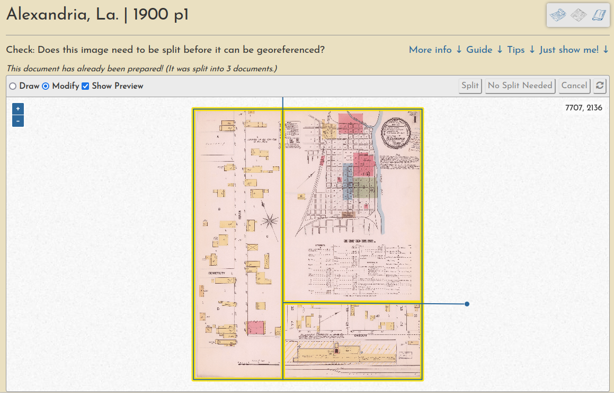

# Overview

In this application, the entire process of making mosaics from the volume content comprises three sequential steps, each with its own tool interface:

1. [Preparating the Sheets (Splitting)](guides/preparation.md)
2. [Georeferencing the Documents](guides/georeferencing.md)
3. [Trimming the Layers](guides/trimming.md)

These steps need to be completed in order, but they don't have to be completed all in one sitting. In fact, Georeferencing and Trimming can be revisited at any time, so you can improve on your past work, or build from someone else's.

Tips for using each tool accompany its interface, and similar content is presented in the following pages as well.

!!! info
    
    These steps are best carried out on a laptop/desktop computer, though a nimble user *should* be able to perform them on a mobile device as well.

The georeferencing process generally consists of three operations, each with their own browser interface.

Document preparation (sometimes they must be split into multiple pieces):

Ground control point creation (these are used to warp the document into a geotiff):

And a "multimask" that allows a volume's sheets to be trimmed *en masse*, a quick way to create a seamless mosaic from overlapping sheets:

Learn much more about each step [in the docs](https://ohmg.dev/docs/category/making-the-mosaics-1).

All user input is tracked through registered accounts, which allows for a comprehensive understanding of user engagement and participation, as well as a complete database of all input georeferencing information, like ground control points, masks, etc.
