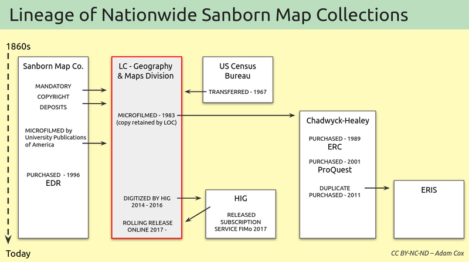

# Sanborn Maps

## Source of the Archive

The Sanborn Map Company surveyed and mapped American cities from the late 1860's through the 1950's, creating city atlases and selling them to insurance companies on a subscription basis. The extensive details they recorded for each building&mdash;commercial use, construction materials, and exact locations of heat sources (to name but a few)&mdash;provided insurance companies with the information they needed to geographically visualize and balance their risk.

Map production had begun to wind down in the 1950s, but the usefulness of the collection as a historical reference (far beyond its original purpose) was already recognized. In all, the company mapped over 12,000 American communities, generally returning to each one every 5-7 years to create a full update. The result is an unparaled cartographic record of urban development in the U.S., and an archive with much potential.

Above is an attempt to chart the lineage of the main Sanborn map collections out there, highlighting how the LOC collection came be such an authoritative one. What is not shown are the hundreds of local or statewide collections held at various universities and similar institutions (these are best found through the [Sanborn Union list](https://www.lib.berkeley.edu/EART/sanborn_union_list) by Philip Hoehn). Please [get in touch](./community.md#contact) if you feel there are issues with this chart.

## Using Sanborn Maps Today

In recent years, advances in geospatial and web technology have provided new ways to re-engage with these maps. For example, some companies sell access to their own digital collections of the maps, for environmental assessment reviews

- [EDR](https://edrnet.com/introducing-sanborn-viewer/)
- [ERIS](https://www.erisinfo.com/eris-xplorer/)

or historical research (you may have access to the following through your university or local library)

- [FIMo](http://www.historicalinfo.com/fimo/)
- [ProQuest](https://about.proquest.com/en/products-services/sanborn/).

Additionally, various institutional efforts have created free viewers, as in

- [Boston (Boston Public Library)](https://atlascope.leventhalmap.org)
- [Bozeman (City of Bozeman)](https://www.arcgis.com/apps/webappviewer/index.html?id=f4cf486b4d7f4988aa589e7dd989f5e9)
- [Milwaukee (American Geographical Society Library)](http://webgis.uwm.edu/agsl/sanborn/)

and digital history projects often use georeferenced maps as foundational materials

- [Homestead Hebrew Maps (Lauren Winkler)](https://maps.homesteadhebrews.com/)
- [Keweenaw Time Traveler (Michigan Tech University)](https://kett.geospatialresearch.mtu.edu/)
- [Reconstructing Bloomington (Indiana University)](https://storymaps.arcgis.com/stories/f38fd8915aa14f4e99b96455dcdad49e)
- [What the Tulsa Race Massacre Destroyed (NY Times)](https://www.nytimes.com/interactive/2021/05/24/us/tulsa-race-massacre.html).

For **much** more, see this Library of Congress [Sanborn Internet Resources](https://guides.loc.gov/fire-insurance-maps/sanborn-resources) page.
